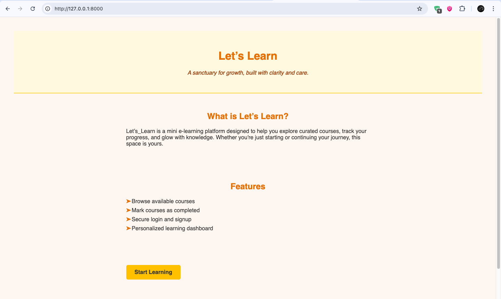
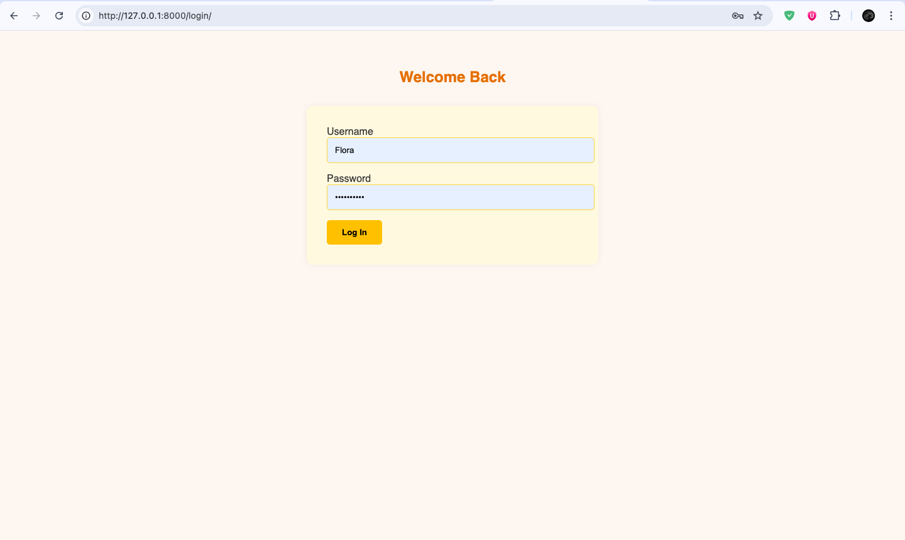
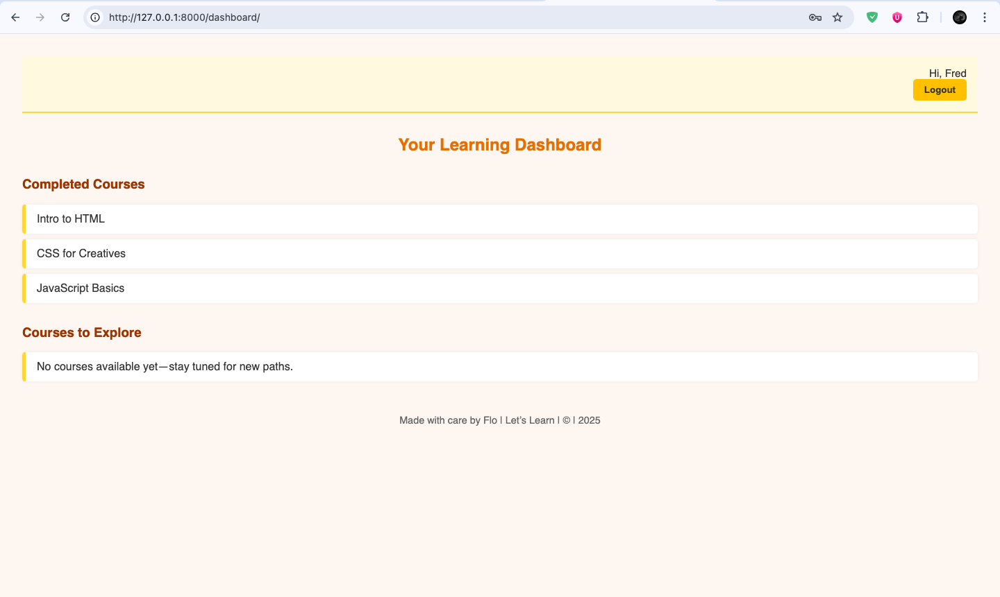

## `README.md` — Let’s Learn

# Let’s_Learn

Let’s_Learn is a Django-based e-learning platform developed as part of an academic assignment.It is a functional prototype which allows users to sign up, log in, browse available courses, mark them as completed, and view progress on a personalized dashboard.

This project demonstrates core Django functionality including authentication, routing, templating, and basic CRUD operations.


##  Features

- Browse available courses
- Mark courses as completed
-  Secure login and signup
-  Personalized learning dashboard
- Poetic empty states and gentle UI
- Custom styling with warm color palette (caramel, copper, desert tan)

---

##  Tech Stack

- **Backend**: Django 5.2.6
- **Frontend**: HTML, CSS (custom styling)
- **Auth**: Django’s built-in authentication
- **Database**: SQLite (default)

---

##  Setup Instructions

1. **Clone the repository**  
   ```bash
   git clone https://github.com/Flora72/AI_WK1
   cd AI_WK1
   ```

2. **Create and activate a virtual environment**  
   ```bash
   python3 -m venv .venv
   source .venv/bin/activate
   ```

3. **Install dependencies**  
   ```bash
   pip install -r requirements.txt
   ```

4. **Apply migrations**  
   ```bash
   python manage.py makemigrations
   python manage.py migrate
   ```

5. **Create a superuser (optional)**  
   ```bash
   python manage.py createsuperuser
   ```

6. **Run the server**  
   ```bash
   python3 manage.py runserver
   ```

7. Visit `http://127.0.0.1:8000/` to begin

---

##  Screenshots

### Landing Page


###  Login Page


###  Signup Page


###  Dashboard


---

##  Project Philosophy

Let’s Learn is more than a platform—it’s a learning sanctuary. Every route, template, and message is crafted to feel intentional and emotionally safe. From poetic empty states to gentle onboarding, this project reflects a commitment to clarity, warmth, and expressive design.

---

